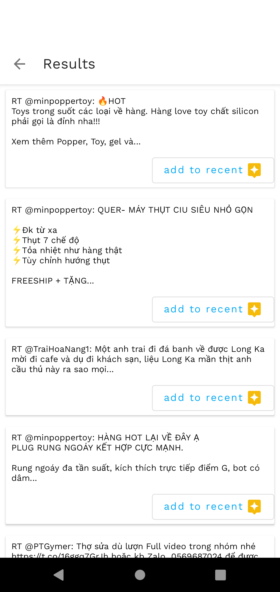

# Twitter search App
* Enable user to Search and save Recent a tweets from tweeter Api

## PreRequisities

- [A valid Tweeter Bearer Token](https://developer.twitter.com/en/docs/twitter-api/getting-started/getting-access-to-the-twitter-api)

## Setup
-First, create a file keys.properties in your root directory with the values for different secret keys:

TWITTER_BEARER_TOKEN = AAAAAAAAAAAAAAAAAAAAAG1fWAEAAAAAHcOKvBVtJVASmxmaFlRvDqNYDhU%3DBMvmmtB2efRlUUJ8hekrPWIraGRRWr3hbdQHAnVjn9tT6FDDxO

- Build the project

<table>
<tr>
<td>

</td>
<td>

</td>
<td>

</td>
</tr>

<tr>
<td>

</td>
<td>

</td>
</table>

## Tech-stack

* Tech-stack
    * [Kotlin](https://kotlinlang.org/) - a cross-platform, statically typed, general-purpose programming language with type inference.
    * [Coroutines](https://kotlinlang.org/docs/reference/coroutines-overview.html) - perform background operations.
    * [Flow](https://kotlinlang.org/docs/reference/coroutines/flow.html) - handle the stream of data asynchronously that executes sequentially.
    * [Hilt](https://developer.android.com/training/dependency-injection/hilt-android) - Hilt is a dependency injection library for Android that reduces the boilerplate of doing manual dependency injection in your project.
    * [Retrofit](https://square.github.io/retrofit/) - A type-safe HTTP client for Android.
    * [Jetpack](https://developer.android.com/jetpack)
        * [Room](https://developer.android.com/topic/libraries/architecture/room) - a persistence library provides an abstraction layer over SQLite.
        * [LiveData](https://developer.android.com/topic/libraries/architecture/livedata) - is an observable data holder.
        * [Lifecycle](https://developer.android.com/topic/libraries/architecture/lifecycle) - perform action when lifecycle state changes.
        * [ViewModel](https://developer.android.com/topic/libraries/architecture/viewmodel) - store and manage UI-related data in a lifecycle conscious way.
        * [Jetpack Navigation](https://developer.android.com/guide/navigation/navigation-getting-started) -  Implement navigation, from simple button clicks to more complex patterns, such as app bars and the navigation drawer.

* Architecture
    * MVVM - Model View View Model

* Plugins
    * [Detekt](https://github.com/detekt/detekt) - a static code analysis tool for the Kotlin programming language.

* CI/CD
    * Github Actions
    
* Tests
    * [Unit Tests](https://en.wikipedia.org/wiki/Unit_testing) ([JUnit](https://junit.org/junit4/)) - a simple framework to write repeatable tests.
    * [MockK](https://github.com/mockk) - mocking library for Kotlin
    * [Truth](https://github.com/google/truth) - Truth makes your test assertions and failure messages more readable.

 
    

